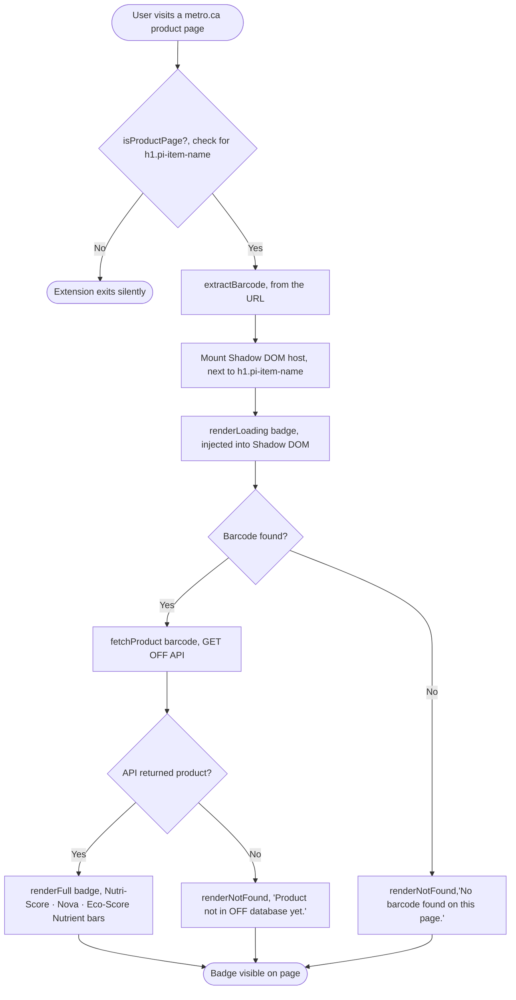

## Prototype working

When visiting a product page on [Metro](metro.ca), the extension:

1. Detects the product page using the selector `h1.pi-item-name`
2. Scrapes the EAN number that is embedded in the URL for the product
3. Sends an API request to the OFF Canada API
4. Injects the extension into the product page with information about the product

The badge contains:

| Field             | Details                                       |
| ----------------- | --------------------------------------------- |
| **Sodium**        | % Daily Value bar (Health Canada: 2400 mg DV) |
| **Sugars**        | % Daily Value bar (100 g DV)                  |
| **Saturated Fat** | % Daily Value bar (20 g DV)                   |
| **Nutri-Score**   | A → E                                         |
| **NOVA group**    | 1 → 4                                         |
| **Eco-Score**     | A → E                                         |

## States

Currently the badge has only 3 states Loading, Found and Not Found

## Flow



## Current Prototype Tech Stack

I previously mentioned that I will be using React and Tailwind but it turned out to be too ambitious because I didn't expect the caveats that comes with a web framework being used in an Extension. React adds bundle weight and can conflict with grocery sites running their own React instance. Shadow DOM is also used so there is no conflict between the extension's CSS styles.
I am choosing Typescript for type safety and easier management of API response data through interface.

| Tool                     | Role                                   |
| ------------------------ | -------------------------------------- |
| [WXT](https://wxt.dev)   | Extension                              |
| TypeScript               | Language throughout                    |
| Vanilla DOM + Shadow DOM | UI with full style isolation           |
| CSS                      | Scoped styles injected into Shadow DOM |
| OFF Canada REST API      | Product data source                    |

## Prototype File Structure

```
estore-extension/
  entrypoints/
    content/
      index.ts       ← entry point, ties everything together
      extract.ts     ← scrapes barcode + detects product page
      api.ts         ← fetches product from OFF API
      badge.ts       ← renders all badge states as DOM elements
      badge.css      ← all badge styles (imported ?inline)
  wxt.config.ts      ← WXT config, Metro host permissions only
```

## Local Setup

```
git clone https://github.com/DevDs1989/OFF-EStoreExtension.git
cd OFF-EStoreExtension
npm isntall
```

### Scripts

| Command                 | Description                  |
| ----------------------- | ---------------------------- |
| `npm run dev`           | Start dev build (Chrome)     |
| `npm run dev:firefox`   | Start dev build (Firefox)    |
| `npm run build`         | Production build (Chrome)    |
| `npm run build:firefox` | Production build (Firefox)   |
| `npm run zip`           | Package for Chrome Web Store |
| `npm run zip:firefox`   | Package for Firefox Add-ons  |
| `npm run compile`       | TypeScript type check only   |

## OFF API Reference

### Barcode Lookup

```
GET https://world.openfoodfacts.org/api/v0/product/{barcode}.json
Response: { status: 1, product: { ... } }   // status 0 = not found
```

### Health Canada %Daily Value Thresholds

| Nutrient      | Daily Value | High     | Low     |
| ------------- | ----------- | -------- | ------- |
| Sodium        | 2400 mg     | ≥ 15% DV | < 5% DV |
| Sugars        | 100 g       | ≥ 15% DV | < 5% DV |
| Saturated Fat | 20 g        | ≥ 15% DV | < 5% DV |

## Future TODO's

- Add More Websites
- Add fallbacks to the product matching pipeline to compensate for missing EAN/Barcode (dom scraping -> fuzzy matching -> user confidence voting)
- Local caching of products for faster loading on reload
- Call to action for user to contribute to the OFF Canada Database for missing products
- Work on UI\UX:
  - Layout matching according to different websites
  - Add hover functionality for more information\generate curiosity
  - Modularity to add new websites (Does the `$store.content` folder structure count??)
- Testing of the modules and functionality (using Vitest for unit testing, Playwright for E2E testing (need to learn))
