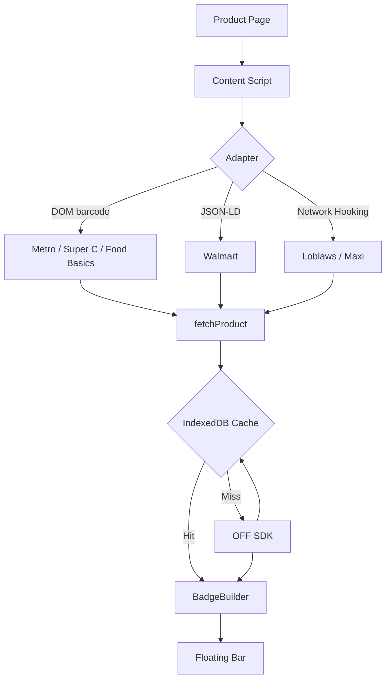

# Open Food Facts — eStore Extension

Browser extension that overlays real-time nutritional data from [Open Food Facts](https://world.openfoodfacts.org) onto Canadian grocery websites.

## Supported Sites

| Site                         | Region | Barcode Source              |
| ---------------------------- | ------ | --------------------------- |
| [Metro](https://metro.ca)    | Quebec | EAN from URL                |
| [Super C](https://superc.ca) | Quebec | EAN from URL (Metro banner) |

## Screenshots

#### Closed State


#### Open State


## How It Works

When visiting a product page, the extension:

1. Detects the product page via the registered `SiteAdapter`
2. Extracts the EAN barcode depending on the strategy
3. Fetches product data from the OFF Canada API
4. Mounts a Shadow DOM UI in the bottom of the page.

### Badge Fields

| Field             | Details                                       |
| ----------------- | --------------------------------------------- |
| **Sodium**        | % Daily Value bar (Health Canada: 2400 mg DV) |
| **Sugars**        | % Daily Value bar (100 g DV)                  |
| **Saturated Fat** | % Daily Value bar (20 g DV)                   |
| **Nutri-Score**   | A → E                                         |
| **NOVA group**    | 1 → 4                                         |
| **Eco-Score**     | A → E                                         |

### Badge States

| State         | Trigger                                            |
| ------------- | -------------------------------------------------- |
| **Loading**   | Shown immediately while API call is in flight      |
| **Found**     | Product data returned from OFF                     |
| **Not Found** | No barcode on page, or product not in OFF database |

### Flow



## Tech Stack

| Tool                           | Role                                      |
| ------------------------------ | ----------------------------------------- |
| [WXT](https://wxt.dev)         | Extension framework, cross-browser builds |
| TypeScript                     | Language throughout                       |
| Vanilla DOM + Shadow DOM       | UI with full style isolation              |
| CSS (`cssInjectionMode: 'ui'`) | Scoped styles via `createShadowRootUi`    |
| OFF Canada REST API            | Product data source (Will migrate to NodeJS SDK                      |
| IndexedDB | Caching of product data |

## Architecture

**Site Adapter pattern** — each supported site implements a `SiteAdapter` with `isProductPage()`, `extractBarcode()`,. Adding a new site means one new adapter file.

**BadgeBuilder pattern** — badge construction is handled by a `BadgeBuilder` class that assembles sections (`withNutrients()`, `withScores()`, `withAllergens()`, etc.) before calling `.build()`.

## File Structure

```
estore-extension/
  entrypoints/
    content/
      index.ts              ← entry — detects product page, runs adapter
      adapters/
        metro.ts            ← Metro adapter
        superc.ts           ← Super C adapter (Metro banner)
        types.ts            ← SiteAdapter interface
        registry.ts         ← getAdapter()
        utils.ts            ← shared barcode extraction utilities
      ui/
        BadgeBuilder.ts     ← badge assembly
        badge.css           ← shadow DOM scoped styles
        states/
          full.ts
          loading.ts
          notFound.ts
      api/
        client.ts           ← OFF API fetch
  wxt.config.ts
```

## Local Setup

```bash
git clone https://github.com/DevDs1989/OFF-EStoreExtension.git
cd OFF-EStoreExtension
npm install
```

### Scripts

| Command                 | Description                  |
| ----------------------- | ---------------------------- |
| `npm run dev`           | Dev build (Chrome)           |
| `npm run dev:firefox`   | Dev build (Firefox)          |
| `npm run build`         | Production build (Chrome)    |
| `npm run build:firefox` | Production build (Firefox)   |
| `npm run zip`           | Package for Chrome Web Store |
| `npm run zip:firefox`   | Package for Firefox Add-ons  |
| `npm run compile`       | TypeScript type check only   |

## OFF API Reference

```
GET https://world.openfoodfacts.org/api/v0/product/{barcode}.json
Response: { status: 1, product: { ... } }   // status 0 = not found
```

### Health Canada %DV Thresholds

| Nutrient      | Daily Value | High     | Low     |
| ------------- | ----------- | -------- | ------- |
| Sodium        | 2400 mg     | ≥ 15% DV | < 5% DV |
| Sugars        | 100 g       | ≥ 15% DV | < 5% DV |
| Saturated Fat | 20 g        | ≥ 15% DV | < 5% DV |

## Roadmap

- Walmart Canada, Food Basics, Maxi, Loblaws adapters
- IndexedDB caching (products + matches)
- Popup UI — score toggles, allergen flags, EN/FR language preference
- Onboarding page
- Vitest unit tests
